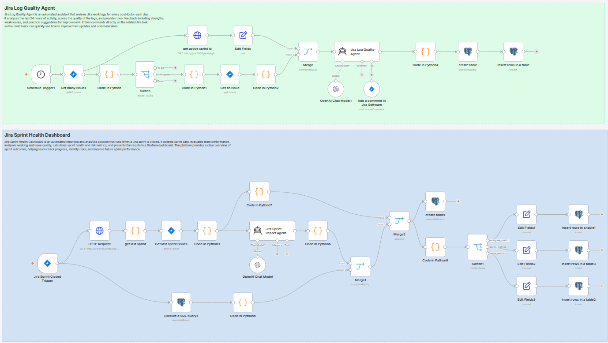
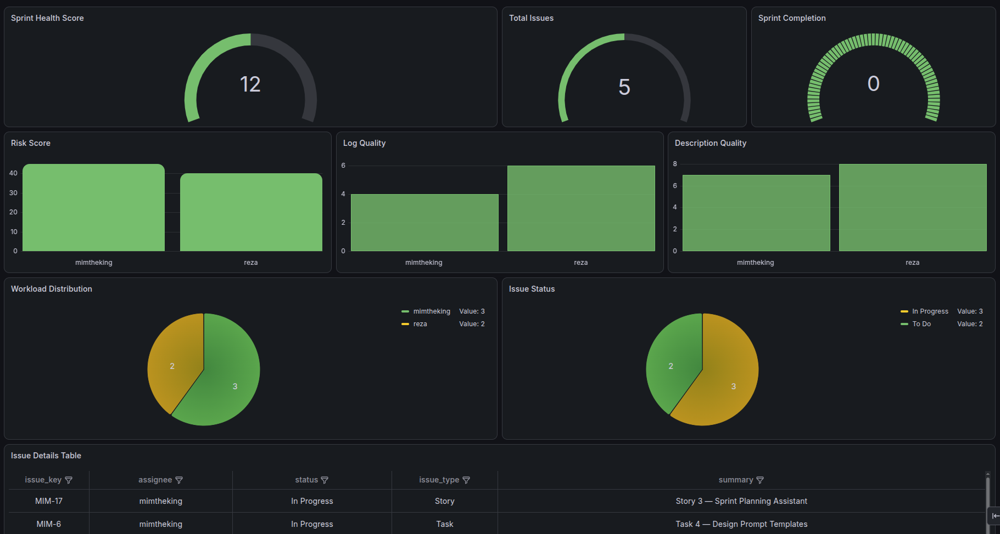

# Jira-assistant
AI-powered Jira assistant that reviews task logs daily, scores update quality, posts feedback with improvement suggestions, and generates sprint review reports for project managers.

This repository contains two automated Jira workflows built with **n8n**:

## Jira Log Quality Agent
An automated assistant that reviews Jira work logs for each contributor every day. It analyzes the last 24 hours of activity, scores log quality, and adds feedback directly to the related Jira task to help improve updates and communication.

## Jira Sprint Health Dashboard
An automated reporting solution that runs when a Jira sprint is closed. It collects sprint data, evaluates team performance, calculates sprint health and risk metrics, and visualizes the results in a **Grafana** dashboard.

## Included Files
- `workflow/` — n8n workflow files
- `dashboard-grafana.json` — Grafana dashboard configuration

## Screenshots

